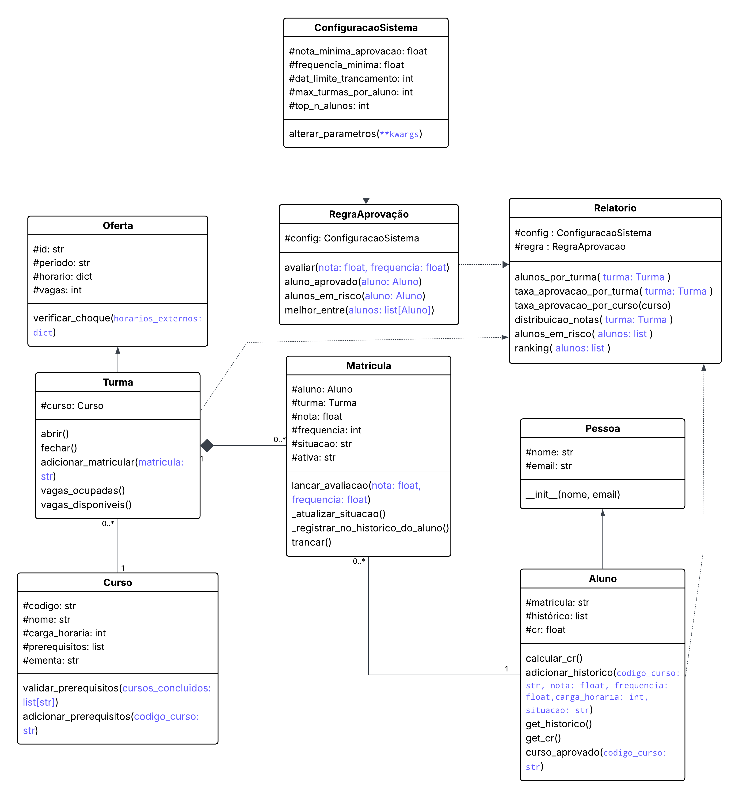

# Gerenciador Acadêmico — FastAPI (POO)

## 📋 Descrição do Projeto

Este projeto consiste no desenvolvimento de uma API REST para gerenciar informações acadêmicas relacionadas a cursos, turmas, alunos e matrículas. A aplicação permite cadastrar e consultar cursos, abrir turmas com controle de vagas e horários, registrar alunos, realizar matrículas com diversas validações e acompanhar o desempenho acadêmico por meio de notas, frequência e relatórios.

O objetivo do sistema é aplicar de forma prática os princípios de Programação Orientada a Objetos, incluindo encapsulamento, herança, composição de objetos, validações, métodos especiais e persistência de dados, integrando-os a uma API moderna. A arquitetura foi projetada para garantir baixo acoplamento, reutilização de código, clareza estrutural e separação de responsabilidades.

A persistência será realizada com banco de dados SQLite, e a API será totalmente documentada por meio da interface automática do FastAPI, permitindo testes e integração facilitados.


---

##  Estrutura das Classes (Planejamento)

A modelagem do sistema é organizada em torno das seguintes classes principais:

- **Pessoa**: classe base com informações comuns a indivíduos do sistema (nome, e-mail).
- **Aluno**: herda de Pessoa e representa um estudante, contendo matrícula, histórico e cálculo de coeficiente de rendimento.
- **Curso**: representa um curso com código único, nome, carga horária e pré-requisitos.
- **Oferta**: classe genérica representando uma oferta acadêmica em um período, com horários e vagas.
- **Turma**: herda de Oferta e vincula alunos a um curso específico em um período, permitindo lançamento de notas e frequência.
- **Matrícula**: registra o vínculo entre aluno e turma, armazenando nota, frequência, situação e controle de trancamento.
- **Configuração do Sistema**: centraliza parâmetros globais utilizados pelas regras do sistema.
- **Regra de Aprovação**: avalia a situação da matrícula com base nas configurações definidas.
- **Relatório**: responsável pela geração de informações consolidadas do sistema (ex.: taxa de aprovação, distribuição de notas, ranking de alunos).

Essa estrutura permite uma arquitetura modular, escalável e aderente aos princípios de POO, garantindo que cada classe possua responsabilidade única e bem definida.

---

## 📊 Diagrama de Classes



---

## 🛠️ Tecnologias Utilizadas

O projeto será desenvolvido utilizando:

| Tecnologia | Finalidade | Status |
|-----------|------------|--------|
| **Python** | Linguagem de programação principal do sistema | ✅ Ativo |
| **FastAPI** | Framework para criação da API REST com validação automática e documentação gerada | ⏳ Planejado |
| **SQLite** | Banco de dados leve utilizado para persistência de informações | ✅ Ativo |
| **SQLAlchemy** | ORM para gerenciamento de banco de dados | ⏳ Planejado |
| **Pydantic** | Validação e serialização de dados | ⏳ Planejado |
| **pytest** | Framework para testes automatizados | ✅ Ativo |
| **Git** | Controle de versão do código | ✅ Ativo |
| **GitHub** | Plataforma para hospedagem e versionamento remoto do repositório | ✅ Ativo |

---

## 🚀 Como Executar

### Pré-requisitos
- Python 3.10 ou superior
- pip (gerenciador de pacotes Python)

### Instalação

```bash
# Clonar o repositório
git clone https://github.com/FranciscoVitorNunes/courses-students-manager.git
cd courses-students-manager

# Criar ambiente virtual
python -m venv venv
source venv/bin/activate  # Windows: venv\Scripts\activate  , Linux: source venv/bin/activate

# Instalar dependências
pip install -r requirements.txt
```

### Executar Testes

```bash
# Criar o Banco de Dados de Teste
python database/setup.py

# Rodar com verbosidade
pytest -v
```

---

## 📝 Padrões de Código

### Convenções de Nomenclatura
- **Classes**: PascalCase (ex: `Aluno`, `Curso`)
- **Métodos/Funções**: snake_case (ex: `calcular_cr()`, `adicionar_historico()`)
- **Constantes**: UPPER_SNAKE_CASE (ex: `STATUS_ABERTA`)
- **Atributos Protegidos**: Prefixo `_` (ex: `_matricula`, `_historico`)

### Encapsulamento
- Todos os atributos são protegidos (prefixados com `_`)
- Acesso via propriedades `@property`
- Validações no `__init__` e setters quando necessário

### Herança
- Usar `super().__init__()` para chamar construtor da classe pai
- Documentar relacionamento de herança no docstring

### Métodos Especiais
- `__str__()`: Representação amigável para usuários
- `__repr__()`: Representação técnica para desenvolvedores
- `__eq__()`: Comparação de igualdade
- `__lt__()`: Comparação para ordenação (quando aplicável)
- `__hash__()`: Permitir uso em sets/dicts (para objetos únicos)
- `__iter__()`: Permitir iteração quando aplicável


